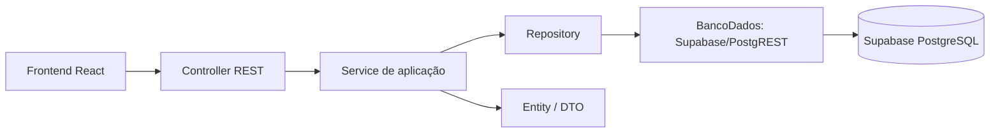

# Mapa atual do projeto

Backend é uma API REST (Spring Boot) sobre Supabase/PostgreSQL. Não há Thymeleaf, JSP nem templates: os controllers devolvem JSON em `/api/**`, o frontend React (em `../frontend/`) consome esses contratos.



```text
src/main/java/paradecision/boot/
├── BootApplication.java
├── comparilhado/
│   ├── dto/       DTOs comuns
│   ├── infra/     BancoDados, Registro, Mapeamento, SupabaseBancoDados, FalhaPersistencia
│   ├── util/      MetodosUteis
│   └── web/       ApiConfig (interceptador), ErrosApi (ProblemDetail), CorsConfig
└── modulos/<modulo>/
    ├── controller/      HTTP REST e JSON
    ├── service/         regras e operações
    ├── entity/          dados do domínio
    ├── dto/             consultas agrupadas e resultados
    └── repository/      consultas parametrizadas via BancoDados
```

Um módulo só contém as camadas que utiliza. Autenticação, por exemplo, delega as operações de usuários aos services desse módulo.

## Como ler a API

- **Controller:** recebe a requisição, valida DTOs e chama o service de aplicação. Devolve JSON (`*Api`) ou `ProblemDetail` em erros. Não acessa SQL ou repositories diretamente.
- **Service:** contém as operações e regras. Recebe as dependências por construtor. Não depende de HTTP.
- **Entity:** representa usuário, empresa, agenda, fator, parecer ou seus vínculos. Não depende de services/repositories/Spring.
- **DTO:** agrupa resultados de consultas e dados de entrada/saída, com validação Bean Validation.
- **Repository:** consultas parametrizadas sobre o contrato `BancoDados`, sem SQL próprio.
- **BancoDados:** contrato único de persistência (`listar`, `inserir`, `atualizar`, `excluir`) implementado por `SupabaseBancoDados` via PostgREST com a chave do servidor.

## Inventário por módulo

### agendas

- `entity`: `Agenda`, `AgendaUsuarioPerfil`.
- `dto`: `AgendaApi`, `AgendaFatoresDados`, `AgendaPareceresDados`, `AgendaUsuarioPareceresDados`, `AgendaUsuariosDados`.
- `service`: `AgendaAplicacaoService`, `AgendaFatoresService`, `AgendaService`, `AgendaUsuarioPareceresService`, `AgendaUsuarioPerfilService`, `AgendaUsuariosService`, `CalculoResultadoAgendaService`, `ExecutorCalculoAgenda`.
- `repository`: `AgendaFatoresRepository`, `AgendaPareceresRepository`, `AgendaRepository`, `AgendaUsuarioPareceresRepository`, `AgendaUsuarioPerfilRepository`, `AgendaUsuariosRepository`.
- `controller`: `AgendaController`.

### autenticacao

- `controller`: `AutenticacaoController` (`POST /api/autenticacao/login`, `GET /me`, `POST /logout`).
- `dto`: `LoginApi`.

### empresas

- `entity`: `Empresa`, `EmpresaUsuarioPerfil`.
- `dto`: `EmpresaApi`, `EmpresaAgendasDados`, `EmpresaUsuariosDados`.
- `service`: `EmpresaAplicacaoService`, `EmpresaAgendasService`, `EmpresaUsuarioPerfilService`, `EmpresaUsuariosService`.
- `repository`: `EmpresaAgendasRepository`, `EmpresaUsuarioPerfilRepository`, `EmpresaUsuariosRepository`.
- `controller`: `EmpresaController`.

### fatores

- `entity`: `Fator`.
- `dto`: `FatorApi`.
- `service`: `FatorAplicacaoService`, `FatorService`.
- `repository`: `FatorRepository`.
- `controller`: `FatorController`.

### pareceres

- `entity`: `ParecerFatorUsuario`.
- `dto`: `ParecerApi`.
- `service`: `ParecerAplicacaoService`, `ParecerFatorUsuarioService`.
- `repository`: `ParecerFatorUsuarioRepository`.
- `controller`: `ParecerController`.

### usuarios

- `entity`: `Usuario`.
- `dto`: `UsuarioApi`, `UsuarioEmpresasDados`.
- `service`: `UsuarioAplicacaoService`, `UsuarioEmpresasService`, `UsuarioService`, `Senhas`.
- `repository`: `UsuarioEmpresasRepository`, `UsuarioRepository`.
- `controller`: `UsuarioController`.

## Rotas da API

| Método | Rota | Contrato |
|---|---|---|
| POST | `/api/autenticacao/login` | `LoginApi` → `UsuarioApi` (cookie de sessão) |
| GET | `/api/autenticacao/me` | `UsuarioApi` |
| POST | `/api/autenticacao/logout` | — |
| GET | `/api/empresas` | `List<EmpresaApi>` |
| GET | `/api/empresas/{id}/usuarios` | `List<UsuarioApi>` |
| GET | `/api/empresas/{empresa}/agendas` | `List<AgendaApi>` |
| POST | `/api/empresas/{empresa}/agendas` | `AgendaApi` (201) |
| GET | `/api/agendas/{id}` | `AgendaApi` |
| PUT | `/api/agendas/{id}` | `AgendaApi` |
| PATCH | `/api/agendas/{id}/status` | `AgendaApi` |
| POST | `/api/agendas/{id}/calculos` | `AgendaApi` |
| GET | `/api/agendas/{id}/usuarios` | `List<AgendaUsuarioPerfil>` |
| PUT/DELETE | `/api/agendas/{id}/usuarios/{usuario}` | — |
| GET | `/api/agendas/{agenda}/fatores` | `List<FatorApi>` |
| POST | `/api/agendas/{agenda}/fatores` | `FatorApi` |
| PUT | `/api/fatores/{id}` | `FatorApi` |
| GET | `/api/agendas/{agenda}/pareceres/meus` | `List<ParecerApi>` |
| PUT | `/api/fatores/{fator}/pareceres/meu` | `ParecerApi` |
| POST | `/api/empresas/{empresa}/usuarios` | `UsuarioApi` (201) |
| PUT | `/api/empresas/{empresa}/usuarios/{id}` | `UsuarioApi` |

Toda rota `/api/**` exige sessão (exceto login) e as escritas exigem `X-Requested-With: XMLHttpRequest`. Erros usam RFC 7807 (`ProblemDetail`). Documentação interativa em `/swagger-ui.html`.

## Autenticação e autorização

Sessão por cookie (`httpOnly`, `SameSite=strict`). O interceptador `ApiConfig` exige `usuarioId` na sessão e a proteção de escrita; `ErrosApi` traduz exceções em `ProblemDetail`. `AcessoService` aplica as regras de autorização (empresa, gestor, agenda, perfis). Senhas: PBKDF2-HMAC-SHA256 (ver `Senhas`).

## CORS

Se o frontend for publicado em outra origem, informe `app.cors-origins` (ou `CORS_ORIGINS`) com a URL pública do frontend. Sem isso, a API fica fechada à mesma origem.

## Banco, execução e testes

Acesso ao banco exclusivamente via `SupabaseBancoDados`/PostgREST usando `SUPABASE_URL` e `SUPABASE_SECRET_KEY` (ou `config/banco-local.properties`). Esquema em `../banco/supabase.sql`; veja `../banco/README.md`.

Use JDK 21 e `mvnw.cmd clean package`. Os testes em `src/test/java/paradecision/boot` cobrem a API REST, arquitetura, cálculo concorrente e o adaptador Supabase, sem depender do banco real.

Veja [como executar](../README.md) e [como publicar](deploy/RENDER.md).