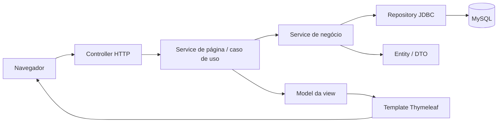

# Mapa atual do projeto

O projeto é um monólito modular Spring MVC. As telas usam Thymeleaf, sem JSP. O backend separa a entidade dos serviços que a utilizam.



```text
src/main/java/paradecision/boot/
├── BootApplication.java
├── compartilhado/
│   ├── dto/       DadosFormulario e DadosPagina
│   ├── infra/     ConnectionFactory
│   ├── util/      MetodosUteis
│   └── web/       FragmentosAdvice e campos comuns
└── modulos/<modulo>/
    ├── controller/      HTTP e escolha de template
    ├── service/         regras e operações
    │   └── pagina/      coordenação dos formulários/telas
    ├── entity/          dados do domínio
    ├── dto/             consultas agrupadas e resultados
    └── repository/      JDBC / SQL

src/main/resources/
├── application.properties
├── templates/<modulo>/
└── static/{compartilhado,autenticacao,pareceres,bootstrap}/
```

Um módulo só contém as camadas que utiliza. Início e autenticação, por exemplo, delegam as operações de usuários aos services desse módulo.

## Como ler o MVC

- **Controller:** recebe a requisição, monta `DadosFormulario`, chama o service e retorna o template. Não acessa SQL ou repositories diretamente.
- **Service:** contém as operações e regras. Recebe as dependências por construtor. Não depende de HTTP.
- **Entity:** representa usuário, empresa, agenda, fator, parecer ou seus vínculos. Não depende de services/repositories/Spring. São classes Java para JDBC, sem JPA.
- **DTO:** agrupa resultados de consultas e dados de entrada/saída. Não é service nem entidade persistida individualmente.
- **Repository:** mantém o SQL/JDBC. Cada conexão é local à operação.
- **View:** templates HTML com dados do Model, CSS e JavaScript separados.

`service/pagina` coordena as operações herdadas dos formulários e produz os mapas que os templates já usam. Os mapas `pagina`, `controle`, `controleAgenda` e `controleFator` preservam o contrato de renderização. `DadosPagina` organiza listas por linha da view; ele é um DTO auxiliar, sem acesso a banco.

## Inventário por módulo

### agendas

- `entity`: `Agenda`, `AgendaUsuarioPerfil`.
- `dto`: `AgendaFatoresDados`, `AgendaPareceresDados`, `AgendaUsuarioPareceresDados`, `AgendaUsuariosDados`.
- `service`: `AgendaFatoresService`, `AgendaService`, `AgendaUsuarioPareceresService`, `AgendaUsuarioPerfilService`, `AgendaUsuariosService`, `CalculoResultadoAgendaService`, `ExecutorCalculoAgenda`.
- `repository`: `AgendaFatoresRepository`, `AgendaPareceresRepository`, `AgendaRepository`, `AgendaUsuarioPareceresRepository`, `AgendaUsuarioPerfilRepository`, `AgendaUsuariosRepository`.
- `controller`: `AgendaFatoresPaginaController`, `AgendaFatoresResultadosPaginaController`, `AgendaUsuariosEditarPaginaController`, `AgendaUsuariosPaginaController`, `AgendaUsuariosPareceresPendenciaPaginaController`, `CadastroAgendaEditarPaginaController`, `CadastroAgendaPaginaController`, `InterAgendaUsuariosPaginaController`, `InterCadastroAgendaEditarPaginaController`, `InterCadastroAgendaPaginaController`, `InterCalcAgendaPaginaController`, `InterFluxoAgendaPaginaController`.
- `service/pagina`: 11 serviços de coordenação de telas/formulários.

### autenticacao

- `controller`: `LoginIniPaginaController`, `LoginPaginaController`.
- `service/pagina`: 2 serviços de coordenação de telas/formulários.

### diagnostico

- `dto`: `DiagnosticoBanco`.
- `service`: `AcessoBancoService`.
- `repository`: `DiagnosticoBancoRepository`, .
- `controller`: `TestebdPaginaController`, `TestegeralPaginaController`, `TesteipPaginaController`.
- `service/pagina`: 3 serviços de coordenação de telas/formulários.

### empresas

- `entity`: `Empresa`, `EmpresaUsuarioPerfil`.
- `dto`: `EmpresaAgendasDados`, `EmpresaUsuariosDados`.
- `service`: `EmpresaAgendasService`, `EmpresaUsuarioPerfilService`, `EmpresaUsuariosService`.
- `repository`: `EmpresaAgendasRepository`, `EmpresaUsuarioPerfilRepository`, `EmpresaUsuariosRepository`.
- `controller`: `EmpresaAgendasPaginaController`, `EmpresaUsuariosPaginaController`.
- `service/pagina`: 2 serviços de coordenação de telas/formulários.

### fatores

- `entity`: `Fator`.
- `service`: `FatorService`.
- `repository`: `FatorRepository`.
- `controller`: `CadastroFatorEditarPaginaController`, `CadastroFatorPaginaController`, `InterCadastroFatorEditarPaginaController`, `InterCadastroFatorPaginaController`.
- `service/pagina`: 3 serviços de coordenação de telas/formulários.

### inicio

- `controller`: `IndexPaginaController`.
- `service/pagina`: 1 serviços de coordenação de telas/formulários.

### pareceres

- `entity`: `ParecerFatorUsuario`.
- `service`: `ParecerFatorUsuarioService`.
- `repository`: `ParecerFatorUsuarioRepository`.
- `controller`: `AgendaFatoresPareceresPaginaController`, `InterPareceresFatoresPaginaController`.
- `service/pagina`: 2 serviços de coordenação de telas/formulários.

### usuarios

- `entity`: `Usuario`.
- `dto`: `UsuarioEmpresasDados`.
- `service`: `UsuarioEmpresasService`, `UsuarioService`.
- `repository`: `UsuarioEmpresasRepository`, `UsuarioRepository`.
- `controller`: `CadastroUsuarioEditarPaginaController`, `CadastroUsuarioPaginaController`, `InterCadastroUsuarioEditarPaginaController`, `InterCadastroUsuarioPaginaController`, `InterUsuarioEmpresasPaginaController`, `UsuarioEmpresasPaginaController`.
- `service/pagina`: 5 serviços de coordenação de telas/formulários.

## Rotas

As URLs e os métodos GET/POST da migração anterior foram preservados. Entre pela `/`; as telas internas usam códigos e perfis enviados pelos formulários anteriores.

| Rota | Controller | Template |
|---|---|---|
| `/compartilhado/ctrltargetpage` | `CtrltargetpagePaginaController` | `compartilhado/ctrltargetpage.html` |
| `/agendas/AgendaFatores` | `AgendaFatoresPaginaController` | `agendas/AgendaFatores.html` |
| `/agendas/AgendaFatoresResultados` | `AgendaFatoresResultadosPaginaController` | `agendas/AgendaFatoresResultados.html` |
| `/agendas/AgendaUsuariosEditar` | `AgendaUsuariosEditarPaginaController` | `agendas/AgendaUsuariosEditar.html` |
| `/agendas/AgendaUsuarios` | `AgendaUsuariosPaginaController` | `agendas/AgendaUsuarios.html` |
| `/agendas/AgendaUsuariosPareceresPendencia` | `AgendaUsuariosPareceresPendenciaPaginaController` | `agendas/AgendaUsuariosPareceresPendencia.html` |
| `/agendas/CadastroAgendaEditar` | `CadastroAgendaEditarPaginaController` | `agendas/CadastroAgendaEditar.html` |
| `/agendas/CadastroAgenda` | `CadastroAgendaPaginaController` | `agendas/CadastroAgenda.html` |
| `/agendas/interAgendaUsuarios` | `InterAgendaUsuariosPaginaController` | `agendas/interAgendaUsuarios.html` |
| `/agendas/interCadastroAgendaEditar` | `InterCadastroAgendaEditarPaginaController` | `agendas/interCadastroAgendaEditar.html` |
| `/agendas/interCadastroAgenda` | `InterCadastroAgendaPaginaController` | `agendas/interCadastroAgenda.html` |
| `/agendas/interCalcAgenda` | `InterCalcAgendaPaginaController` | `agendas/interCalcAgenda.html` |
| `/agendas/interFluxoAgenda` | `InterFluxoAgendaPaginaController` | `agendas/interFluxoAgenda.html` |
| `/autenticacao/loginIni` | `LoginIniPaginaController` | `autenticacao/loginIni.html` |
| `/autenticacao/login` | `LoginPaginaController` | `autenticacao/login.html` |
| `/diagnostico/testebd` | `TestebdPaginaController` | `diagnostico/testebd.html` |
| `/diagnostico/testegeral` | `TestegeralPaginaController` | `diagnostico/testegeral.html` |
| `/diagnostico/testeip` | `TesteipPaginaController` | `diagnostico/testeip.html` |
| `/empresas/EmpresaAgendas` | `EmpresaAgendasPaginaController` | `empresas/EmpresaAgendas.html` |
| `/empresas/EmpresaUsuarios` | `EmpresaUsuariosPaginaController` | `empresas/EmpresaUsuarios.html` |
| `/fatores/CadastroFatorEditar` | `CadastroFatorEditarPaginaController` | `fatores/CadastroFatorEditar.html` |
| `/fatores/CadastroFator` | `CadastroFatorPaginaController` | `fatores/CadastroFator.html` |
| `/fatores/interCadastroFatorEditar` | `InterCadastroFatorEditarPaginaController` | `fatores/interCadastroFatorEditar.html` |
| `/fatores/interCadastroFator` | `InterCadastroFatorPaginaController` | `fatores/interCadastroFator.html` |
| `/`, `/index` | `IndexPaginaController` | `index.html` |
| `/pareceres/AgendaFatoresPareceres` | `AgendaFatoresPareceresPaginaController` | `pareceres/AgendaFatoresPareceres.html` |
| `/pareceres/interPareceresFatores` | `InterPareceresFatoresPaginaController` | `pareceres/interPareceresFatores.html` |
| `/usuarios/CadastroUsuarioEditar` | `CadastroUsuarioEditarPaginaController` | `usuarios/CadastroUsuarioEditar.html` |
| `/usuarios/CadastroUsuario` | `CadastroUsuarioPaginaController` | `usuarios/CadastroUsuario.html` |
| `/usuarios/interCadastroUsuarioEditar` | `InterCadastroUsuarioEditarPaginaController` | `usuarios/interCadastroUsuarioEditar.html` |
| `/usuarios/interCadastroUsuario` | `InterCadastroUsuarioPaginaController` | `usuarios/interCadastroUsuario.html` |
| `/usuarios/interUsuarioEmpresas` | `InterUsuarioEmpresasPaginaController` | `usuarios/interUsuarioEmpresas.html` |
| `/usuarios/UsuarioEmpresas` | `UsuarioEmpresasPaginaController` | `usuarios/UsuarioEmpresas.html` |

## Recursos compartilhados e fluxo

`templates/compartilhado` tem cinco fragmentos: cabeçalho, confirmação e os três grupos de campos de controle. Eles não têm endpoints próprios. `ctrltargetpage` continua como página intermediária.

A entrada abre o login no iframe. O login carrega usuário, empresas e perfil; o fluxo encaminha para empresas/agendas. Os status da agenda escolhem participantes, fatores, pareceres ou resultados. Formulários `inter*` executam a operação e retornam a navegação. Os campos `ct_*` e `pdAcao` continuam representando esse estado.

Os assets próprios ficam em `static/compartilhado`, `static/autenticacao` e `static/pareceres`. A tabela de rotas e as funções de navegação ficam em `static/compartilhado/js/funcoesFluxo.js`.

## Banco, execução e testes

O acesso permanece em JDBC, com configuração em `compartilhado/infra/ConnectionFactory.java`. O repositório não contém o esquema/carga SQL. Não foi feita alteração de tabelas para esta separação em camadas.

Use JDK 21 e `mvnw.cmd clean package`. O POM permanece com Spring Boot, Web MVC, Thymeleaf e MySQL Connector. Os testes em `src/test/java/paradecision/boot` cobrem templates, fluxos HTTP com services reais, arquitetura e cálculo concorrente, sem depender do MySQL real.

Veja [como executar](../README.md), [o detalhe desta refatoração](REFATORACAO_BACKEND.md) e [o histórico da remoção de JSP](MIGRACAO_FRONTEND.md).

## Limpeza de código sem uso

Foram removidas dez classes sem consumidores ou sem processamento, além da dependência Lombok não utilizada. As telas de cadastro sem processamento próprio retornam o template diretamente pelo controller; os envios continuam nos services. Pacotes vazios e comentários de código desativado também foram removidos.
